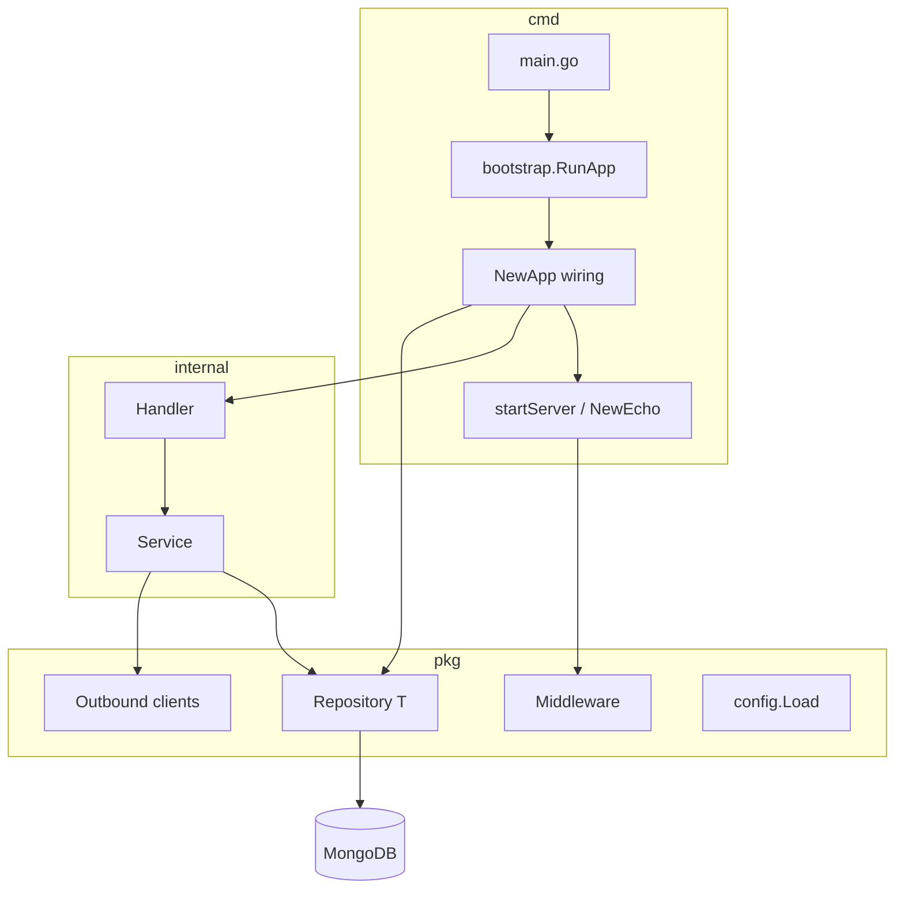

# Go API service blueprint (Echo + MongoDB)

This document describes the **application structure and design patterns** used in the reference codebase so you can scaffold a **new, unrelated project** with the same shape: clean layering, explicit composition in bootstrap, shared infrastructure in `pkg`, and domain code in `internal`.

Share this file with an AI agent or teammate as the **single source of truth** for layout, dependency flow, and conventions.

---

## 1. Goals of this architecture

- **Thin HTTP layer**: handlers parse/bind/validate, call services, map errors to HTTP + JSON.
- **Business logic in services**: orchestration, rules, mapping to repositories and external clients.
- **Data access via a generic repository**: one `Repository[T]` type over MongoDB collections; avoid one-off repository structs unless a domain truly needs specialized persistence code.
- **Explicit wiring**: all construction happens in `cmd/.../bootstrap` (constructors like `NewApp`, `NewXService`, `NewXHandler`), not in global singletons.
- **Multiple deployable binaries** (optional): same module, different `main` packages (e.g. `admin` vs `client`) with separate route tables and Swagger output directories.

---

## 2. Recommended tech stack (match reference)

| Concern | Choice |
|--------|--------|
| Language | Go (modern version per `go.mod`) |
| HTTP | [Echo v4](https://github.com/labstack/echo) |
| Database | MongoDB with [official Go driver v2](https://github.com/mongodb/mongo-go-driver) |
| Validation | [go-playground/validator](https://github.com/go-playground/validator) wired as `echo.Validator` |
| Config | Environment variables, optional [godotenv](https://github.com/joho/godotenv) for local `.env` |
| API docs | [swaggo/swag](https://github.com/swaggo/swag) + [echo-swagger](https://github.com/swaggo/echo-swagger) |
| Logging | `log/slog` with optional file / Elasticsearch sinks (project-specific) |
| Tests | `testing` + table-driven tests; `httptest` + `App.NewEcho()` for HTTP-level tests |

Adjust libraries as needed; **keep the directory and layer boundaries** even if you swap Redis, Postgres, etc.

---

## 3. Repository layout

```
.
├── cmd/
│   ├── <service-a>/
│   │   ├── main.go              # Swagger @title/@BasePath; calls bootstrap.RunApp()
│   │   ├── bootstrap/
│   │   │   ├── app.go           # NewApp(): config, db, repos, services, handlers, index setup
│   │   │   ├── routes.go        # setupRoutes(e): groups, middleware per group, handler binding
│   │   │   └── server.go        # NewEcho(), startServer(), graceful shutdown, optional cron/jobs
│   │   ├── docs/                # Generated: swag init -g cmd/<service-a>/main.go -o cmd/<service-a>/docs
│   │   ├── Dockerfile
│   │   └── .air.toml            # Optional live reload
│   └── <service-b>/             # Same pattern if you ship multiple binaries
├── internal/
│   └── <domain>/                # One package per bounded context
│       ├── <domain>.go          # Entities + request/response DTOs (json/bson tags)
│       ├── service.go           # *Service methods: (ctx context.Context, ...) (domain types, error)
│       └── handler.go           # *Handler methods: (c echo.Context) error
├── pkg/
│   ├── config/                  # Load env → *Config (no domain imports from internal/)
│   ├── database/                # ConnectMongoDB, GetCollection, generic Repository[T]
│   ├── middleware/            # Auth, rate limit, request context, access logs, etc.
│   ├── errormap/              # Stable JSON error shape: tag + message (+ optional debug)
│   ├── jwt/                   # Issue/validate tokens (if applicable)
│   ├── requestctx/            # Values derived from JWT / request (user id, phone, …)
│   ├── logger/                # slog setup from config
│   └── validator/             # Echo validator adapter
├── Makefile                     # targets: run with air, swagger per binary, docker build
├── docker-compose.yml         # Local deps (mongo, redis, …)
├── go.mod
└── CLAUDE.md / AGENTS.md      # Optional: human/agent-oriented project notes
```

**Rules**

- `internal/`: business domains only. **Do not** import `internal/` from `pkg/` (Go enforces this for external consumers; keep it clean internally too).
- `pkg/`: reusable infrastructure and outbound clients (HTTP wrappers to third parties, DB helpers, middleware).
- `cmd/<binary>/bootstrap/`: the **composition root** — the only place that should know “everything” and wire the graph.

---

## 4. Request flow (non-negotiable direction)

```
HTTP Request
    → Echo middleware (logging, recover, auth, …)
    → Handler  (bind, validate, read path/query)
    → Service  (business logic, transactions, calls to pkg clients)
    → Repository[T] or pkg client (Mongo, REST, …)
    → Handler  (map error → status + JSON; success → JSON)
```

- Handlers **must not** embed business rules (beyond trivial HTTP concerns).
- Services **must not** depend on `echo.Context`; pass `context.Context` as the first parameter.
- Repositories **must not** know about HTTP status codes.

---

## 5. Bootstrap pattern (reference implementation)

### 5.1 `main.go`

- Keep **minimal**: package `main` imports only `.../cmd/<name>/bootstrap` and calls `bootstrap.RunApp()`.
- Put **Swagger global annotations** on `main` (`@title`, `@version`, `@host`, `@BasePath`, `@schemes`).

### 5.2 `RunApp()`

Typical responsibilities:

1. Optional: set process timezone (`time.Local`) if the product is calendar-sensitive.
2. `app, err := NewApp()` — on failure, log and `os.Exit(1)`.
3. `app.startServer()` — blocks until shutdown signal.

### 5.3 `NewApp() (*App, error)`

Order matters; a practical sequence:

1. `cfg := config.Load()` (env + optional `.env`).
2. Logger from config.
3. `database.ConnectMongoDB(...)` → `*mongo.Database`.
4. Instantiate `*database.Repository[T]` per collection via `database.NewRepository[T](database.GetCollection("..."))`.
5. Create **indexes** in dedicated functions (e.g. `createUserIndexes(db)`) called from `NewApp` so first boot is safe for production-like deploys.
6. Construct outbound **HTTP/RPC clients** (`pkg/...`) with timeouts and TLS options from config.
7. Construct **services** (inject repos + clients + logger + cfg as needed).
8. Construct **handlers** (inject services only — not repos).
9. Return `&App{...}` holding pointers the server and routes need (cfg, db, logger, handlers, optional cron targets).

### 5.4 `App` struct

- Holds `cfg`, `db`, `logger`, repositories, services, handlers — whatever `setupRoutes` and background jobs need.
- Keeps **state in one place** for tests: expose `func (a *App) NewEcho() *echo.Echo` that configures Echo and calls `setupRoutes` **without** listening, so tests can run `httptest.Server`.

### 5.5 `NewEcho()` / `startServer()`

**`NewEcho()`**

- `e := echo.New()`
- `e.Validator = validator.New()` (or project equivalent).
- Global middleware: recover, request logger, optional access log to Elasticsearch, compression, etc.
- `a.setupRoutes(e)`
- Return `e`.

**`startServer()`**

- Build Echo from `NewEcho()`.
- `go e.Start(":" + port)`.
- Optional: start `cron` or background workers.
- Wait on `SIGINT` / `SIGTERM`, then `e.Shutdown(ctx)` with a timeout.
- Close Elasticsearch handler or other flushable resources on exit.

---

## 6. Routing conventions

- Register **Swagger UI** on a path like `/swagger/*` with `echo-swagger`, and **blank-import** generated docs in `routes.go`:

  ```go
  _ "your.module/cmd/<service>/docs"
  ```

- Expose **`/health`** at root (and optionally under API prefix) returning JSON `{"status":"ok"}`.
- Group APIs by version: e.g. `/api/v1`, `/api/admin/v1`.
- Split large route files into `setupXRoutes(api *echo.Group)` methods on `*App`.
- Apply **auth middleware per group**, not globally, when public endpoints exist:

  ```go
  auth := middleware.Auth(cfg.JWTSecret)
  g := api.Group("/resource", auth)
  g.GET("/:id", app.handler.getByID)
  ```

- Attach a **request context** middleware early (user id, roles, locale) so handlers/services read values via a small `pkg/requestctx` helper instead of parsing JWT everywhere.

---

## 7. Domain package template (`internal/<domain>/`)

### 7.1 Entities (`<domain>.go`)

- Use a **type block** to group structs.
- DTOs for HTTP: `CreateXRequest`, `UpdateXRequest`, response structs as needed.
- Tags: **`json` and `bson`** where MongoDB is used; prefer **consistent field naming** (e.g. snake_case in JSON if that is your API standard).
- IDs: pick one strategy and document it — string hex IDs, ObjectID in BSON only, UUIDs, etc. — and use the same approach in repositories and URL params.

### 7.2 Service (`service.go`)

- `type XService struct { ... }` with concrete dependencies (`*database.Repository[T]`, clients, logger).
- Constructor: `NewXService(...) *XService`.
- Methods: **camelCase** names (e.g. `createUser`, `getBill`) if matching the reference style; first arg `ctx context.Context`.
- Return **domain errors** or wrapped standard errors; map `database.ErrNotFound` to domain-level “not found” messages.

### 7.3 Handler (`handler.go`)

- `type XHandler struct { service *XService }` + `NewXHandler(...)`.
- For each route: bind → validate → call service with `c.Request().Context()` → return `c.JSON(status, body)`.
- Use **`pkg/errormap`** (or equivalent) for consistent error JSON instead of ad-hoc shapes.

### 7.4 Swagger

Every exported HTTP entrypoint should have `swag` comments: `@Summary`, `@Description`, `@Tags`, `@Accept`, `@Produce`, `@Param`, `@Success`, `@Failure`, `@Router`.

Regenerate after changes:

```bash
swag init -g cmd/<service>/main.go -o cmd/<service>/docs
```

---

## 8. Data layer: generic repository

- Provide `ConnectMongoDB` and `GetCollection(name) *mongo.Collection` in `pkg/database`.
- Implement `Repository[T]` with methods such as: `Create`, `FindByID`, `FindOne`, `FindAll`, `Update`, `Delete`, pagination helpers, raw `Collection()` escape hatch for complex queries.
- Define sentinel errors: `ErrNotFound`, `ErrInvalidID`, etc.; services check with `errors.Is`.
- **Prefer** `bson.M` / `bson.D` filters in services when using the escape hatch.

---

## 9. Configuration (`pkg/config`)

- Single `Config` struct (or grouped structs) loaded once at startup.
- Read from `os.Getenv`; optionally load `.env` in dev via godotenv.
- Avoid writing secrets to logs.
- Pass `*config.Config` into services/clients that need feature flags or URLs — avoid a mutable global except optionally `var Global *Config` if you accept that tradeoff for ergonomics.

---

## 10. Errors and HTTP mapping

Stable client-facing shape (example from reference):

```json
{
  "tag": "input",
  "message": "Human-readable message",
  "debug_error": "optional; dev/staging only"
}
```

- Handlers choose **HTTP status** from error semantics (400 validation, 401 unauthorized, 404 not found, 409 conflict, 500 internal).
- Services return errors that handlers can classify (`errors.Is`, typed errors, or `strings.Contains` on stable sentinel messages — prefer typed errors for new code).

---

## 11. Middleware stack (typical)

Global:

- Recovery (panic → 500).
- Request logging.
- Optional: structured access log to Elasticsearch with a **skipper** for noisy paths (`/health`, metrics).

Route-specific:

- JWT `Auth(secret)` on protected groups.
- Rate limiting, RBAC, idempotency keys — as needed per product.

---

## 12. Local development

- **Makefile** targets: `make <service>` using [Air](https://github.com/air-verse/air) per `cmd/<service>/.air.toml`; `make swagger-<service>` wrapping `swag init`.
- **docker-compose** for MongoDB, Redis, object storage, etc.
- Document ports per binary (e.g. admin `8080`, client `8081`) in README or `.env.example`.

---

## 13. Testing strategy

- **Service tests**: real or testcontainer MongoDB, or a short-lived in-memory strategy if you add one; table-driven cases per method.
- **HTTP tests**: `app, _ := NewApp()` or a test helper DB, `e := app.NewEcho()`, `httptest.NewServer(e)`.
- **pkg clients**: table-driven tests with `httptest` servers mocking upstream APIs.

---

## 14. Naming and style (aligned with reference)

| Item | Convention |
|------|----------------|
| Go files | `snake_case.go` |
| Exported struct fields | `PascalCase` |
| Functions / methods | **camelCase** for application code (including exported handlers like `getUser`) — match generator output and existing files consistently |
| Packages | single short word (`user`, `billing`, `database`) |
| JSON / BSON tags | Often **snake_case** for API fields |

Project policy on **interfaces**: the reference favors **concrete structs** in hot paths for simplicity; if you introduce interfaces for testing, keep them narrow and close to the consumer.

---

## 15. Minimal new-feature checklist

When adding a domain from scratch:

1. `internal/<domain>/` — entity + service + handler (+ tests if non-trivial).
2. `pkg/database` — only if new collection access patterns are needed (usually just `NewRepository[T]`).
3. `cmd/.../bootstrap/app.go` — wire repo → service → handler; add indexes if required.
4. `cmd/.../bootstrap/routes.go` — register routes under correct group and middleware.
5. `swag init` for that binary’s `main.go`.
6. Update `Makefile` / README if new env vars are required.

---

## 16. What *not* to copy blindly

The reference project contains **domain-specific** integrations (billing ESB, CRM, payment gateways, loyalty, PDF pipelines). For a greenfield app:

- Reuse **structure and flow**, not business types or env var names.
- Start with **one** `cmd/<api>` binary; split into two binaries only when you have a clear deployment boundary (e.g. public app vs internal admin).

---

## 17. One-page diagram



---

**End of blueprint.** Replace module paths, service names, and infrastructure details for your new project; keep the **bootstrap + internal/pkg split + handler/service/repository flow** as the stable skeleton.
